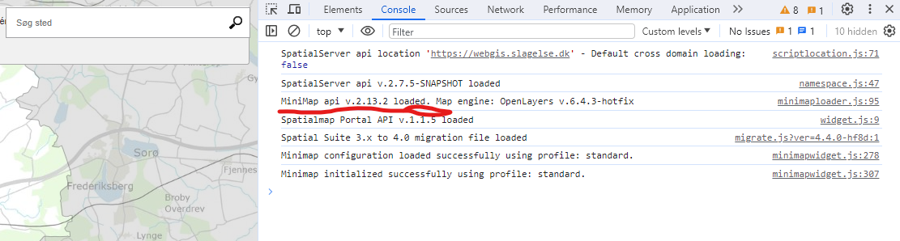

# Skolerute modul til Spatial Suite

Det her repo indeholder et modul til Spatial Suite, samt kildekoden for det, som er skrevet i Vue.  

Folderen **_skolevejVue_** indeholder kildekoden til selve modulet, som ligger i folderen **_./skolerute/dist_**

Modulet er baseret på MiniMap API'et fra Spatial Suite og OpenLayers. 

Marvin Poulsen fra Lolland kommune har tidligere lavet et lignende modul, som det her modul er blevet inspireret af. Det kan findes [her](https://github.com/MarvinPoulsen/skolevej) 🎉

## Dependency
Modulet er afhænigt af SPS route servicen. Det vil **ikke** virke, hvis du har en lokal installation af SPS route. Til at bruge SPS route servicen skal man få en token fra Sweco. Man kan læse mere om det på deres brugerforum [her](https://cbkort.brugerklub.info/forum/viewtopic.php?t=1414).

## Installation  

1. Clone det her repo eller download zip filen og placer indeholdet i din _/modules/custom_ folder. Der skulle gerne være en folder, som hedder _skolerute_ med to underfoldere - _skolerute_ og _skolevejVue_.

2. Installer modulet ved at tilføje følgende til relevante modulfiler:  
   `<module name="skolerute" dir="custom/skolerute/skolerute" permissionlevel="public" />`  

3. Ret parameter i deploy.xml filen (./skolerute/skolerute/deploy.xml).  
   Parameteren _module.skolerute.skole\_ds_ angiver navnet på den datasource, som indeholder de skoler, man skal kunne vælge i mellem.  
   Datasourcen skal pege på en tabel i din database, som har den her struktur:  
   |Kolonne|type|
   |-------|-------|
   |skole|string|
   |vejanavn|string|
   |husnummer|string|
   |postnummer|number|
   |by|string|
   |shape_wkt|geometry|  

   **TIP!** Lav et view i databasen, som er baseret på den skoletabel, som bliver vedligeholdt jævnligt, og brug det i din datasource. På den måde har du altid opdateret skoleliste. I Slagelse har vi brugt den her SQL til at generere tabellen, men det kan gøres på mange måder;  
   ```sql
   CREATE OR REPLACE VIEW temaplaner.skoler_skolevej_modul
      AS SELECT skoler.objectid::character varying AS id,
         skoler.navn AS skole,
         regexp_replace(skoler.adresse::text, '\d*\s?\w?$'::text, ''::text) AS vejnavn,
         reverse(split_part(reverse(skoler.adresse::text), ' '::text, 1)) AS husnummer,
         skoler.postnr AS postnummer,
         skoler.by_ AS by,
         skoler.wkb_geometry AS shape_wkt
      FROM temaplaner.skoler;
   ```

4. Ret henvinsing til minimap.js på linje 7 i ./skolerute/dist/index.html.  
   F.eks. fra;  
   `<script type="text/javascript" src="https://kort.slagelse.dk/clientapi/minimap2/2.13.x/minimap.js"></script>`  
   til;  
   `<script type="text/javascript" src="https://webkort.frederikssund.dk/clientapi/minimap2/2.13.x/minimap.js"></script>`  
   Det er ikke sikkert, at dit site bruger version 2.13.x af minimap api'et. Man kan finde versionsnummeret ved at åbne browserens DevTools (tryk på F12) og refreshe sitet (tryk på F5 eller CTRL+R). Ens MiniMap API version bliver vist der - se screenshot.  

     
   
   Erstat _2.13.x_ med det versions nummer, som bliver vist der. HUSK at det sidste tal skrives med _x_.

   # Viderudvikling

   Hvis du har ønsker eller idéer for, hvad det her skal kunne, så er du velkommen til at skrive til mig på [daarn@slagelse.dk](mailto:daarn@slagelse.dk).  
   
   Du kan også bare oprette et issue her på Github eller forke det her repo og lave en pull request 🥳